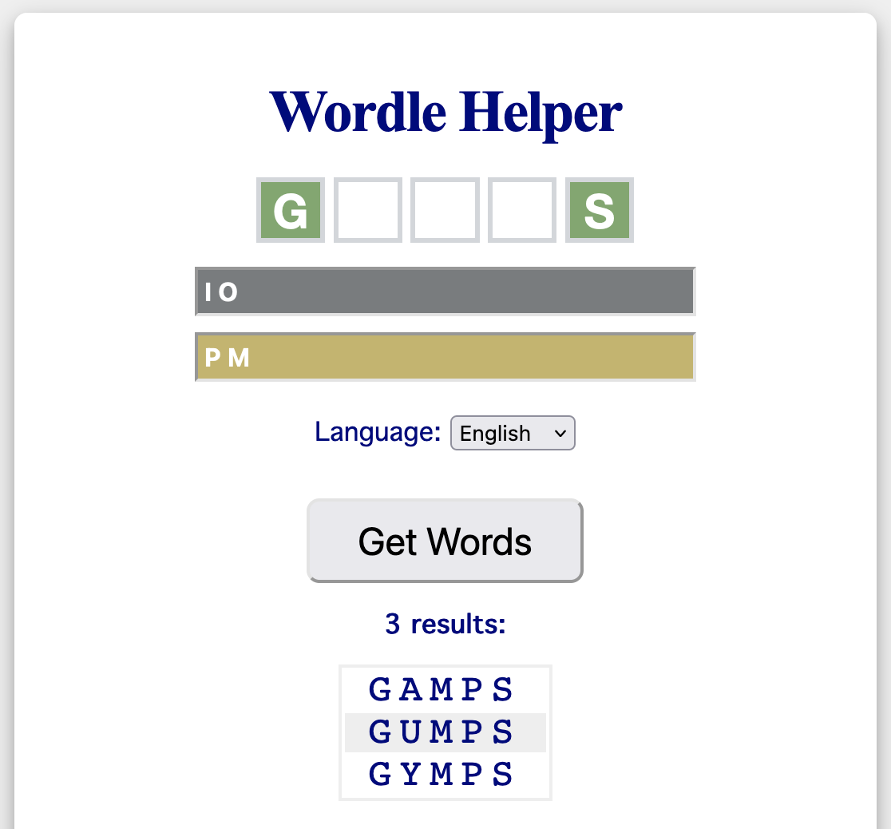

# Wordle Helper
A tool that helps you out when you are stuck with your wordle riddle

# How to Use
* Fill in the letters with known position in the letter boxes
* Enter already ruled out letters in "Excluded Letters" text box (optional)
* Enter letters which are known to occure in "Included Letters" (optional)
* Chose on of the available languages:
   * English
   * German
   * Spanish
* Click "Get Words"